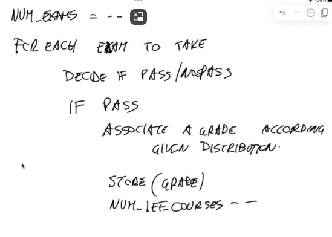

## Student Career
Develop a simulator to evaluate the graduation time and the final grade at a MSc course.

* Explain in details the random elements in the simulated system
* Explain all the input parameters
* Explain all all the output metrics
* Explain all the main data structures
* Explain some interesting correlations between output metrics and input parameters
* For the simulation, use realistic values for all the parameters.

You must produce a document with all the answers, with no more than 2 pages.

### Padlet
#### Questions
* Evaluate the graduation time and the final grade for a course
* What factors influence the graduation time of the students
#### Stochastic elements
* Number of exams takes for each session
* Grade distribution
* Approval or not according to a bernoulli experiment
#### Input parameters
* seed
* accuracy of considered estimators
* average number of exams taken during each session
* total number of courses
* grade distribution from past
* number of exams in each session
* number of session per year
#### Output metrics
* Graduation time distribution/average
* Graduation grade distribution/average
* Number of attempts taken to graduate
* Grade according to the time of graduation
#### Analysis
* graduation time vs. prob of failure
* graduation time vs  final grade
